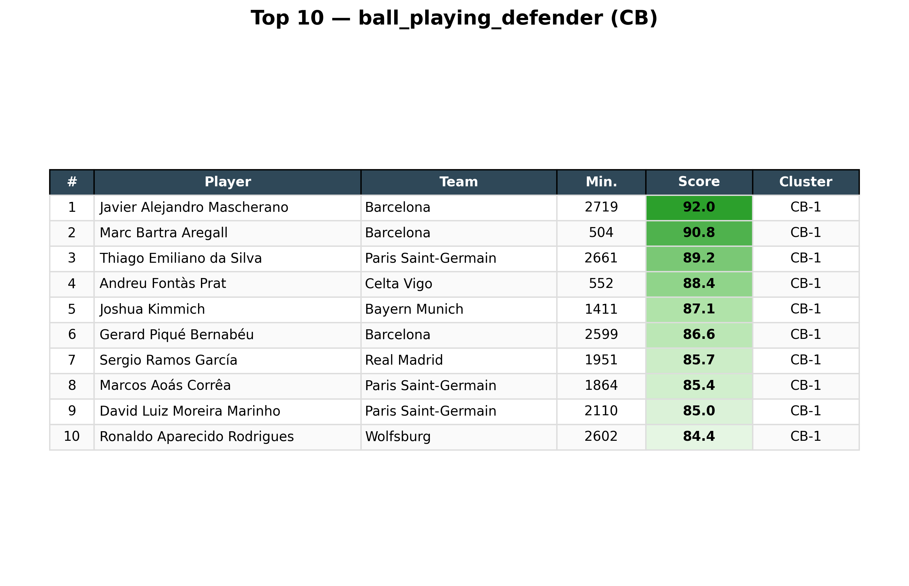
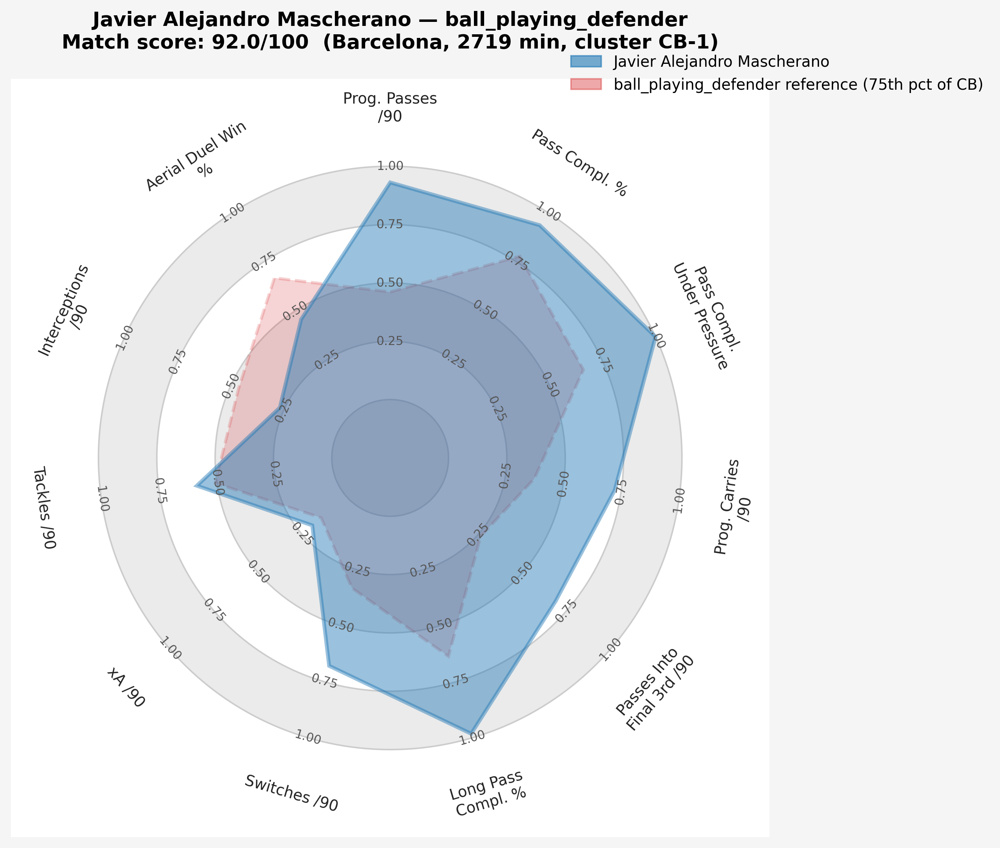
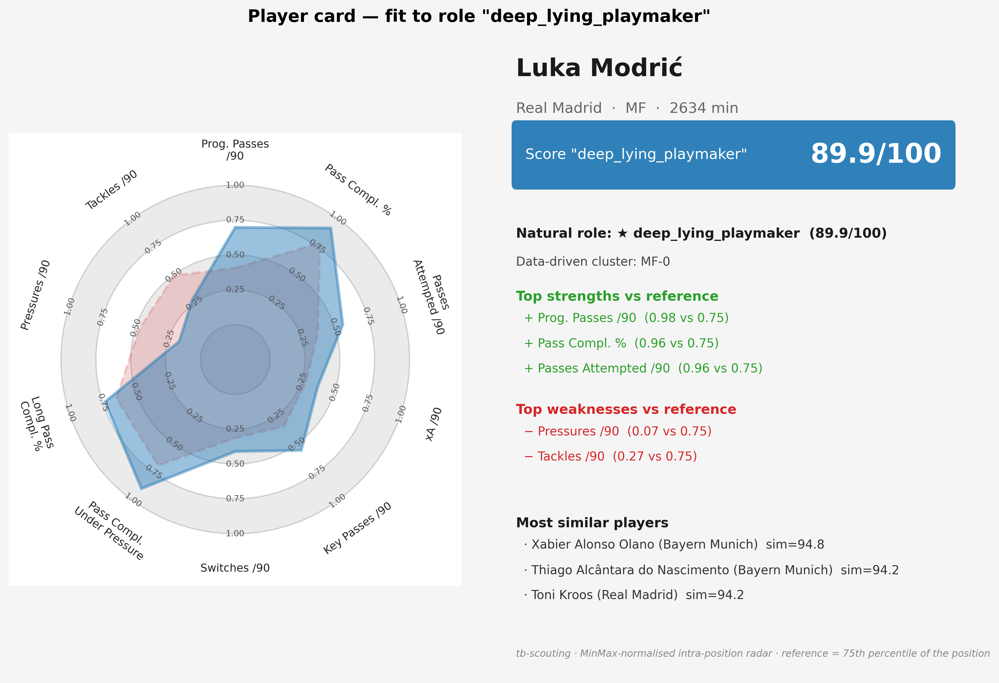

# tb-football-scouting-framework

**Bachelor Thesis — HEG Geneva 2026**
**Author:** André Dos Santos
**Supervisor:** Dr. Grigorios Anagnostopoulos

---

## Overview

A data-driven football scouting framework that bridges the gap between the tactical
needs expressed by professional club staff and the analytical capabilities offered
by open football data.

Given a tactical brief, the framework returns an ordered, **interpretable** shortlist
of players. A brief can be expressed in four complementary ways:

- **Predefined role** — "find me the best deep-lying playmakers" (17 roles shipped in
  `config/role_profiles.yaml`).
- **Custom profile** — an arbitrary `{metric: weight}` dictionary defined in Python at
  the call site, with no configuration change.
- **Similarity search** — "find me players who resemble *X*", through a tactical lens
  of your choosing.
- **Threshold search** — "find me players who clear these minimum bars on each metric".

Every scored output is on a **0–100 scale** with a uniform *higher-is-better* semantic,
including for metrics whose raw value is intrinsically a defect (e.g. dispossessions,
fouls committed) — these are inverted internally and relabelled for display.

All comparisons are **strictly intra-position**: a centre-back is always benchmarked
against other centre-backs, never against strikers (with one explicit opt-in exception,
the cross-position mode described below).

## Dataset

StatsBomb open event data for the **2015/16 season** of the five major European leagues
(La Liga, Premier League, Bundesliga, Ligue 1, Serie A). After a 450-minute season
filter, the processed feature table contains:

| Position group | Players |
|---|---:|
| CB (centre-backs) | 355 |
| FB (full-backs / wing-backs) | 387 |
| MF (central midfielders) | 539 |
| AM (attacking midfielders / wingers) | 304 |
| ST (strikers) | 251 |
| **Total** | **1 836** |

The raw input is ≈ 6 million events. The processed feature matrix is 1 836 players ×
99 columns, of which **51 metrics** feed the scoring engine (42 per-90 normalised counts
+ 9 efficiency rates).

## Pipeline

```
StatsBomb Open Data
        ↓
  Data Extraction       → src/extraction.py     (idempotent download, 5 leagues)
        ↓
  Feature Engineering   → src/features.py        (~50 metrics/player, per 90 min + rates)
        ↓
  Normalisation + PCA   → src/clustering.py      (StandardScaler → PCA 80% variance)
        ↓
  K-Means Clustering    → src/clustering.py      (data-driven role discovery, k chosen by elbow)
        ↓
  Tactical Matching     → src/matching.py        (weighted percentile rank, 0-100 score)
        ↓
  Visualisation         → src/visualisation.py   (radars, ranking tables, PCA scatter, cards)
```

The clustering step fits an **independent** `StandardScaler → PCA(80% variance) →
KMeans` pipeline per position group. Empirically every position resolves to **k = 4
clusters**, with 11–14 PCA components retaining 80.1–81.5 % of the variance. The 15
fitted models are persisted to `models/` (scaler / pca / kmeans × 5 positions).

## Data Source

- [StatsBomb Open Data](https://github.com/statsbomb/open-data) — high-resolution match
  event data (passes, shots, duels, pressures, carries) accessed via `statsbombpy`.

> The pipeline relies on a **single** data source: StatsBomb. xG is taken directly from
> the StatsBomb shot model (`shot_statsbomb_xg`); no external xG provider is used.

## Installation

```bash
git clone https://github.com/YOUR_USERNAME/tb-football-scouting-framework.git
cd tb-football-scouting-framework

python -m venv venv
source venv/bin/activate      # macOS / Linux
venv\Scripts\activate         # Windows

pip install -r requirements.txt
```

## Reproducing the data pipeline

The repository ships with code and configuration but **not the data artefacts**
(`data/`, `models/`, generated `results/`) — they are listed in `.gitignore` because
they are large and trivially reproducible from the open StatsBomb dataset. After
installation, run the pipeline once to regenerate them:

```python
from src.extraction import extract_and_save
from src.features   import build_features
from src.clustering import run_clustering

extract_and_save()    # downloads StatsBomb events for the 5 leagues 2015/16 (~30-60 min)
build_features()      # writes data/processed/player_features.parquet   (1836 × 99)
run_clustering()      # writes data/processed/player_clustered.parquet  (1836 × 103)
                      #   + the 15 model pickles in models/
```

All paths are resolved via `pathlib` from the project root
(`PROJECT_ROOT = Path(__file__).parent.parent` in every `src/` module), so the workflow
runs identically on Windows, macOS, and Linux with no path edits. The extraction step is
**idempotent** — re-running skips files already present in `data/raw/`.

## How scoring works

The framework's core is a **weighted percentile-rank** model, chosen over a cosine
similarity because cosine on strictly-positive vectors compresses scores into a narrow
band and discriminates poorly.

1. For each `(position, metric)` pair, every player receives a **percentile rank**
   ∈ [0, 100] within their position population
   (`raw.rank(pct=True, method='average') * 100`).
2. **Negative metrics** (`dispossessed_p90`, `miscontrols_p90`, `fouls_committed_p90`)
   are inverted (`100 - pct`) so that *higher always means better*. The display layer
   relabels them (`ball_retention_p90`, `ball_control_p90`, `discipline_p90`).
3. A role's **match score** is the weight-averaged percentile across its metrics:
   `score = Σ(pct_i · w_i) / Σ(w_i)`, bounded in [0, 100].

The construction is intuitive: a player at the 75th percentile on every key metric
scores ≈ 75/100; a median player scores ≈ 50; a weakness on a heavily-weighted metric
pulls the score down. The 75th percentile is the reference used for radar charts and
strength/weakness tooltips (a realistic "top quartile" benchmark rather than an
unattainable ceiling).

**Similarity search** uses two measures, picked automatically:
- *role-filtered* modes use a **weighted Manhattan / L1 distance** on percentile ranks
  (`similarity = 100 − Σ(w_i·|pct_target − pct_cand|) / Σ(w_i)`), more discriminative
  than cosine;
- the *full-metric* fallback uses **cosine similarity** on the 51-dim MinMax-normalised
  vector.

## Usage

```python
from src.matching import (
    rank_players_by_role,
    custom_role_search,
    find_similar_players,
    profile_player,
    compare_players,
    percentile_threshold_search,
    list_available_metrics,
)

# 1. Rank players against a predefined role
rank_players_by_role("ball_playing_defender", "CB", top=10)

# 2. Define a custom tactical profile inline (no config change)
custom_role_search("CB", {
    "pass_completion_rate":  3.0,
    "aerial_duel_win_rate":  3.0,
    "progressive_passes_p90": 2.0,
}, top=10)

# 3. Replacement search — players similar to a reference, through a tactical lens
find_similar_players("Verratti", top_n=10)                       # auto-detected natural role
find_similar_players("Verratti", role="ball_winning_midfielder") # explicit lens
find_similar_players("Verratti", use_role_metrics=False)         # full 51-metric cosine

# 4. Player profiling — which role fits a given player best?
profile_player("Modric")          # -> deep_lying_playmaker is his natural role

# 5. Head-to-head percentile comparison
compare_players("Messi", "Neymar", "AM")

# 6. Constraint-based shortlisting — who clears these minimum bars?
percentile_threshold_search("CB", {
    "aerial_duel_win_rate":   80,   # top 20% in the air
    "progressive_passes_p90": 85,   # top 15% in progression
    "interceptions_p90":      70,
    "pass_completion_rate":   75,
})

# Discover the metric vocabulary for any position
list_available_metrics("CB")
```

### Cross-position search

`rank_players_by_role`, `custom_role_search` and `percentile_threshold_search` accept
two opt-in arguments to widen the scoring pool beyond a single position:

```python
# Evaluate AM-tagged players (e.g. a winger like CR7) against an ST poacher template
rank_players_by_role("poacher", "ST", include_adjacent=True)        # adds adjacent positions
rank_players_by_role("poacher", "ST", include_positions=["AM"])     # explicit extra position
```

When the pool spans multiple positions, percentile ranks are **recomputed on the
combined population**, and a console note records the decision. Adjacency follows an
explicit, non-transitive graph (`matching.ADJACENT_POSITIONS`):
`CB ↔ FB ↔ MF ↔ AM ↔ ST`.

## Public API

### `src/matching.py`

| Function | Purpose |
|---|---|
| `rank_players_by_role(role_name, position, min_minutes=450, top=20, verbose=True, include_adjacent=False, include_positions=None)` | Rank every player of a position by their weighted-percentile match score against a YAML role. |
| `custom_role_search(position, custom_weights, min_minutes=450, top=20, verbose=True, include_adjacent=False, include_positions=None)` | Same as above but with a caller-supplied `{metric: weight}` dict instead of a YAML role; returns inline `strengths` / `weaknesses` columns. |
| `find_similar_players(player_name, position=None, top_n=10, role=None, use_role_metrics=True)` | Replacement search. Three modes: auto-detected natural role, explicit `role=`, or full-metric cosine (`use_role_metrics=False`). |
| `profile_player(player_name, position=None, verbose=True)` | Score a player against every role of their position; the top-scoring role is flagged as the *natural role*. |
| `compare_players(player1_name, player2_name, position, metrics=None, top_variance=10)` | Side-by-side percentile comparison; if `metrics=None`, auto-selects the most discriminative metrics. |
| `percentile_threshold_search(position, thresholds, min_minutes=450, near_miss_tolerance=10, include_adjacent=False, include_positions=None)` | Constraint-based search; tiers players into full / near / partial match against per-metric percentile thresholds. |
| `list_available_metrics(position)` | List the 51 usable metrics for a position, grouped into 7 categories. |

Public constants: `ADJACENT_POSITIONS`, `NEGATIVE_METRICS`, `NEGATIVE_DISPLAY_ALIAS`,
`IDEAL_PERCENTILE` (= 75). Use `reset_cache()` if the parquet or YAML changes in-process.

### `src/visualisation.py`

| Function | Output |
|---|---|
| `plot_radar_chart(player_name, role_name, save_path=None, position=None)` | Player profile (blue) vs the 75th-percentile role reference (red dashed), with the match score in the title. |
| `plot_custom_radar(player_name, custom_weights, position=None, save_path=None, profile_label="Custom Profile")` | Same radar but for an inline custom weight dict (≥ 3 metrics required). |
| `plot_ranking_table(role_name, position, top_n=10, save_path=None, min_minutes=450)` | Top-N ranking table with a green score gradient. |
| `plot_pca_scatter(position, highlight_player=None, save_path=None)` | 2-D PCA scatter coloured by cluster, with optional player highlight. |
| `plot_player_card(player_name, role_name, save_path=None, position=None)` | A4-landscape scouting card: radar + score + natural role + strengths/weaknesses + nearest neighbours. |
| `plot_threshold_results(results_df, thresholds, position, save_path=None, near_miss_tolerance=10, max_rows=30)` | Colour-coded threshold-search table (green/orange/blue tiers; per-cell green/orange/red vs the bar). |

Every figure is exported at **300 DPI** to `results/` (relative paths) or to any
absolute path supplied via `save_path`.

## Notebooks

Five notebooks walk through the pipeline from raw data to scouting use cases. All resolve
paths relative to the project root via `pathlib`, so they run unchanged on any machine.

| Notebook | Purpose | Typical runtime |
|---|---|---|
| `00_check_data.ipynb` | Browse the StatsBomb open-data catalogue and pick competitions / seasons. | < 1 min |
| `01_extraction.ipynb` | Download the raw event and lineup parquets to `data/raw/`. Idempotent. | ≈ 30–60 min (first run) |
| `02_features.ipynb` | EDA of the per-player feature table: position-conditioned distributions, correlations, most discriminative metrics. | < 30 s |
| `03_clustering.ipynb` | Walkthrough of the data-driven clusters per position — elbow curves, PCA scatter, cluster-profile heat-maps, representative players. Validates the link between unsupervised clusters and the YAML role taxonomy. | < 1 min |
| `04_demo.ipynb` | **Seven scouting use cases** (chapter-6 deliverable). | ≈ 1–2 min |

### `04_demo.ipynb` — the seven use cases

1. **Finding ball-playing centre-backs** — role ranking + table + radar.
2. **Finding pressing forwards** — same pipeline on a defensive-striker role.
3. **Player profiling** — Modrić's natural role, rendered as a player card.
4. **Similarity search** — Verratti's neighbours under three different similarity lenses.
5. **Custom role search** — an "aerial-dominant ball-playing CB" defined inline.
6. **Constraint-based search** — minimum-bar shortlisting with tiered full / near / partial matches.
7. **Framework limitations** — three documented structural dependencies (position-mapping, tactical-system, temporal), illustrated by Cristiano Ronaldo, Paulo Dybala and Virgil van Dijk, plus the cross-position remedy.

## Visual Examples

Three representative outputs from `notebooks/04_demo.ipynb`, generated programmatically
and exported at 300 DPI.

### Top-10 ranking table — Ball-Playing Defenders (2015/16)

Players are scored against the `ball_playing_defender` role and ranked by their
weighted-percentile match score. The score column uses a green gradient so the spread
within the shortlist is visible at a glance.



### Radar chart — top-ranked player vs the role reference

For any player and role, the radar contrasts the player's intra-position
MinMax-normalised profile (blue) with the 75th-percentile reference of the same position
(red dashed). The title carries the match score that drove the ranking.



### Player card — Luka Modrić, natural role detection

The player card consolidates the diagnostic output in a single A4-landscape sheet:
radar against the empirically detected natural role, top strengths and weaknesses vs the
reference, the data-driven cluster label, and the three closest stylistic neighbours.



## Project Structure

```
tb-football-scouting-framework/
├── config/
│   └── role_profiles.yaml    ← 17 tactical role definitions (weighted metrics)
├── data/
│   ├── raw/                  ← StatsBomb raw events + lineups (auto-generated)
│   └── processed/            ← player_features.parquet, player_clustered.parquet
├── models/                   ← 15 pickles: scaler / pca / kmeans × 5 positions
├── notebooks/
│   ├── 00_check_data.ipynb   ← Browse StatsBomb availability + pick competitions
│   ├── 01_extraction.ipynb   ← Run the StatsBomb event download (idempotent)
│   ├── 02_features.ipynb     ← EDA of the per-player feature table
│   ├── 03_clustering.ipynb   ← Full walkthrough of the per-position clusters
│   └── 04_demo.ipynb         ← Seven use cases demonstrating the framework
│                                (chapter 6 of the thesis)
├── src/
│   ├── __init__.py
│   ├── extraction.py         ← StatsBomb download + raw-data loaders
│   ├── features.py           ← Per-90 + rate metric engineering (vectorised)
│   ├── clustering.py         ← StandardScaler + PCA + K-Means per position
│   ├── matching.py           ← Scoring, ranking, similarity, profiling, thresholds
│   └── visualisation.py      ← Radars, tables, scatter, cards, threshold tables
├── results/                  ← Output figures (300 DPI)
├── requirements.txt
├── LICENSE                   ← MIT
└── README.md
```

## Role Catalogue

Roles are inspired by the Football Manager role taxonomy, translated into quantifiable
StatsBomb metrics. Each role is a weighted combination of metrics in
`config/role_profiles.yaml` (**17 roles** total). The catalogue can be bypassed entirely
via `custom_role_search`, which accepts any user-defined weight dictionary (see
`04_demo.ipynb`, use case 5).

| Position | Roles |
|----------|-------|
| CB | Ball-Playing Defender, No-Nonsense CB, Aerial-Dominant CB |
| FB | Complete Wing-Back, Inverted Wing-Back, Defensive Full-Back |
| MF | Deep-Lying Playmaker, Ball-Winning Midfielder, Box-to-Box Midfielder, Mezzala |
| AM | Advanced Playmaker, Inside Forward, Pressing Winger |
| ST | Advanced Forward, Pressing Forward, Poacher, Deep-Lying Forward |

> The player examples documented in `role_profiles.yaml` are the empirical top-ranked
> players produced by the framework on the 2015/16 dataset — observations, not assumptions.

## Documented limitations

The framework measures *what a player did in a specific season, in a specific system,
under a specific positional label* — not what they are abstractly capable of. Three
structural dependencies are characterised honestly in use case 7 of `04_demo.ipynb`:

- **Position-mapping dependency** — the position label gates which role catalogue a
  player is scored against (illustrated by Cristiano Ronaldo, tagged *Left Wing* → AM).
  Addressed parametrically via the cross-position mode.
- **Tactical-system dependency** — event counts reflect the team's system, not only the
  player's aptitude (illustrated by Paulo Dybala's system-inflated recovery counts).
- **Temporal dependency** — the evaluation is single-season (illustrated by the 2015/16
  Virgil van Dijk, whose ball-playing reputation is a later, post-2018 phenomenon).

These are inherent properties of any event-data-driven scouting system, and they motivate
deploying the framework as **one input to a recruitment decision among others**, alongside
human scout judgment, multi-season aggregation, and video analysis.

## License

MIT License — open source for academic use. See `LICENSE`.
